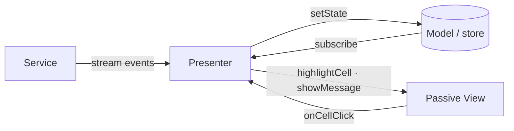

# MVP (Model–View–Presenter)

## Summary

MVP splits an application into three roles: **Model** (truth), **View** (passive display + input surface), and **Presenter** (mediator). The Presenter handles user events, applies rules, updates the Model, and **explicitly tells the View what to show**.

The main difference from [MVC](./mvc.md) in this wiki: **the View does not subscribe to the Model**. The **Presenter** reads state (or receives model notifications) and **pushes** updates to the View through methods like `showMessage()` or `highlightCell()`.

**One-sentence summary (MVP shape for this app):** The Memory Game in MVP is **Model (store + domain) for truth, a passive View that only renders what the Presenter asks and forwards clicks, and a Presenter that orchestrates domain, services, and every screen update**—no reactive View subscriptions to the store.

The **MVP** reference app is [`observable-memory-game-mvp`](../../observable-memory-game-mvp/). See [ARCHITECTURE.md](../../observable-memory-game-mvp/ARCHITECTURE.md) for current status.

That folder is a **copy of the MVC app** today; the MVP refactor (passive View, Presenter, explicit View updates) will be applied there. The **MVC** version remains in [`observable-memory-game`](../../observable-memory-game/).

This document describes the **same game** with **MVP role assignment**—use it to compare who updates the screen and who sits between Model and View.

For the step-by-step build order, see [MVP development flow](#mvp-development-flow-roadmap). Compare with [MVC development flow](./mvc.md#mvc-development-flow-roadmap).

---

## MVP vs MVC (Memory Game)

Keep the domain fixed; change **who updates the View**.

| Question | MVC (current repo) | MVP (this doc) |
|----------|-------------------|----------------|
| Who holds truth? | Model (store + domain) | Model (store + domain) — **same** |
| Who applies rules? | domain, invoked by Controller | domain, invoked by **Presenter** — **same logic, different caller** |
| Who handles cell click? | Controller (`onCellClick`) | **Presenter** (`onCellClick`) |
| Who updates the screen? | **View** subscribes to store | **Presenter** calls View methods after Model changes |
| Does View know the store? | Yes — `gameStateStore.subscribe` | **No** — View knows **Presenter** callbacks / View interface only |
| Pattern sequence | Controller subscribes to service → `setState` → Views react | Presenter subscribes → `setState` → **Presenter** calls `view.updateFromState(state)` |

```text
MVC:  User → View → Controller → domain → store ──subscribe──→ View

MVP:  User → View → Presenter → domain → store → Presenter → View (explicit update)
```

---

## The three roles

### Model

- Holds **application state** and **business rules** (same conceptual layer as MVC).
- Does **not** render the UI.
- In MVP, the Model **may still notify** listeners (e.g. `BehaviorSubject`)—but the **passive View is not one of them**. The **Presenter** listens (or reads `getState()` after each change).

**In the Memory Game example (MVP mapping)**

Reuse the same Model split as MVC:

| Piece | Location (shared repo) | Job in MVP |
|-------|------------------------|------------|
| **State store** | `state/game-state-store.ts` | Holds `GameState`; `getState`, `setState`, `subscribe` |
| **Domain rules** | `domain/rules.ts`, `domain/pattern.ts` | Pure transitions and validation |

Nothing in the Model changes between MVC and MVP for this project—the difference is **who consumes** store updates (Presenter only, not View).

#### Boundary note: Model — state store (`state/`)

| | |
|---|---|
| **Must have** | Single source of truth; read/write/notify API; merge-only `setState`. |
| **Must not have** | Business rules; DOM; knowledge of View or Presenter UI methods. |
| **Common confusions** | ❌ Adding `subscribe` in **View** “for convenience” → breaks passive MVP; **Presenter** subscribes or reads after update. ❌ View-specific fields in `GameState` → keep UI derivable from phase/pattern or pass display DTOs from Presenter. ✅ Same store as MVC doc — Model layer is shared. |

#### Boundary note: Model — domain (`domain/`)

| | |
|---|---|
| **Must have** | Pure functions: `initialGameState`, `appliedUSerInputGameState`, `getNextGameState`, etc. |
| **Must not have** | DOM; RxJS; Presenter or View imports for side effects. |
| **Common confusions** | ❌ Presenter inlining validation → **domain**. ❌ View formatting dates → **View** display method called by Presenter. ✅ Identical to [MVC domain boundary](./mvc.md#boundary-note-model--domain-domain). |

### View

- **Passive (Passive View MVP):** exposes **display methods** and **forwards raw user input** to the Presenter.
- **Does not** subscribe to the Model, **does not** apply business rules, **does not** decide what screen state means for the game.
- May contain **presentation mechanics** (CSS classes, flicker animation) inside methods the Presenter calls—e.g. `highlightCell(index)`—without reading `GameState` directly.

**In the Memory Game example (MVP target shape)**

| Component | MVP responsibility |
|-----------|-------------------|
| **BoardView** | Methods: `highlightCell(i)`, `clearHighlights()`, `setInteractive(enabled)`; forwards `cellClicked(index)` to Presenter |
| **MessageView** | Method: `showMessage(text)` |
| **Templates** (`*.hbs`) | Static layout only; no store import |

Contrast with **current MVC repo**: `Board` calls `gameStateStore.subscribe` and decides highlights from `gamePhase` + `pattern`. In MVP, that “decide what to paint” step moves to the **Presenter**, which calls `boardView.highlightCell(currentCell)` after reading state.

#### Boundary note: View (`components/`, `*.hbs`)

| | |
|---|---|
| **Must have** | DOM/templates; **public display API** (`showMessage`, `highlightCell`, …); forward clicks to Presenter (`onCellClicked` / interface); presentation-only logic inside those methods. |
| **Must not have** | `gameStateStore.subscribe`; `setState`; domain imports; `if (wrong cell) game over`; starting pattern sequence. |
| **Common confusions** | ❌ `subscribe` to store “to stay in sync” → **Presenter** pushes updates (core MVP rule). ✅ `fromEvent` → call `presenter.onCellClick(i)` — same as MVC View→Controller wiring. ❌ Presenter passing entire DOM nodes into domain → Presenter passes **data** to View methods only. ✅ Flicker delay inside `highlightCell` → presentation inside View method. |

### Presenter

- **Replaces the Controller** from MVC in this wiki’s comparison.
- **Handles** user events from the View.
- **Orchestrates:** domain → `setState` → **update View** → services when needed.
- **Subscribes** to Model and/or service streams (not the View).
- Holds **no duplicate long-term truth**—reads from Model after writes.

**In the Memory Game example (MVP target shape)**

| Concern | Presenter (`memory-game-presenter.ts` — conceptual) |
|---------|-----------------------------------------------------|
| Bootstrap | Create store, domain init, construct Views, wire View → Presenter |
| Cell click | `onCellClick` → domain → `setState` → `updateViews(getState())` |
| Pattern sequence | Subscribe to `getPatternSequence`; on emit → domain → `setState` → `updateViews` |
| View sync | `updateViews(state)` maps `GameState` → `boardView.highlightCell(...)`, `messageView.showMessage(...)` |

#### Boundary note: Presenter

| | |
|---|---|
| **Must have** | Thin event handlers; domain calls; `setState`; **explicit View updates** after state changes; service subscription ownership; optional `destroy()`. |
| **Must not have** | DOM manipulation (use View methods); inline business rules; leaving View to guess state from store subscriptions. |
| **Common confusions** | ❌ Skipping `updateViews` after `setState` → screen stale in MVP. ❌ `boardView` subscribing to store “to help Presenter” → passive View broken. ❌ 500-line `updateViews` with business rules → extract mapping helpers; rules stay in **domain**. ✅ Presenter subscribes to store **once** and calls `updateViews` in handler — valid MVP pattern. |

---

## Supporting layers

Same as MVC: **not** extra MVP roles. **Services** and **types** support Model and Presenter.

### Services (`services/`)

Identical role to [MVC services](./mvc.md#services-services): timing/streams (e.g. `getPatternSequence`). **Presenter** subscribes—not View, not service writing to store.

| | |
|---|---|
| **Must have** | Technical plumbing; typed inputs/outputs; delegate pattern generation to **domain**. |
| **Must not have** | `setState`; DOM; calling View methods. |
| **MVP note** | On each emission → Presenter updates Model → Presenter calls View — never service → View directly. |

### Types (`types/`)

Shared contracts: `GameState`, `GamePhase`, `GameStateStore`, plus **View interfaces** in MVP:

```ts
// conceptual — types/view-contracts.ts
type BoardView = {
  highlightCell: (index: CellIndex | null) => void;
  setInteractive: (enabled: boolean) => void;
  onCellClicked: (handler: (index: CellIndex) => void) => void;
};
```

Presenter depends on **interfaces**, not concrete DOM—easier to test with mock views.

---

## Typical sequence

### User clicks a cell (user turn) — MVP

1. User clicks a cell on **BoardView** (View).
2. View calls **`presenter.onCellClick(cellIndex)`**.
3. **Presenter** calls **domain**, then **`setState`** on store.
4. **Presenter** reads current `GameState` (or receives store notification).
5. **Presenter** calls **`updateViews(state)`** → `messageView.showMessage(...)`, `boardView.setInteractive(...)`, etc.
6. View applies DOM changes **only** through those methods.

```text
User click  →  View (forward)  →  Presenter  →  domain  →  store  →  Presenter  →  View (explicit methods)
```

### Pattern sequence (computer turn) — MVP

1. **Presenter** starts `getPatternSequence(gameState)`.
2. On each emission → domain → `setState`.
3. **Presenter** → `boardView.highlightCell(cellIndex)`, `messageView.showMessage(...)`.
4. View never sees the RxJS stream—only Presenter does.

### Side-by-side with MVC

| Step | MVC (repo today) | MVP (this doc) |
|------|------------------|----------------|
| Model updated | `setState` | `setState` — same |
| Screen updates | Store notifies **View** subscribers | **Presenter** calls View methods |
| Click wiring | View → Controller | View → Presenter |

---

## User interaction and event handlers

| Concern | Owner (MVP) | Memory Game |
|---------|-------------|-------------|
| What user sees/clicks | View | Board + message templates |
| Raw click detection | View → forwards to Presenter | `fromEvent` → `presenter.onCellClick` |
| Meaning of click | Presenter + domain | `appliedUSerInputGameState` |
| Updating highlights | **Presenter** instructs View | `boardView.highlightCell(i)` — not store subscribe in View |
| Starting pattern flow | Presenter | `patternSequence` + service subscribe |

### Rules of thumb

- **View forwards, Presenter decides** — same spirit as MVC View→Controller.
- **Every `setState` that affects UI** should be followed by **Presenter-driven View update** (or a store subscription **on the Presenter** that calls `updateViews`).
- **Domain stays pure** — Presenter never grows validation; it calls domain then maps results to View calls.

### Memory Game: who does what on a cell click (MVP)

| Step | Role | What happens |
|------|------|----------------|
| 1 | View | User clicks cell; forward to Presenter |
| 2 | Presenter | domain → `setState` (same logic as MVC Controller) |
| 3 | Model | Store holds new `GameState` |
| 4 | Presenter | `updateViews(getState())` |
| 5 | View | `showMessage`, `highlightCell`, `setInteractive` |

---

## Shared example walkthrough (Memory Game)

### Target layout → MVP roles

```text
observable-memory-game-mvp/src/app/   (MVP target — refactor in this repo folder)
├── memory-game-presenter.ts      → Presenter (replaces Controller orchestration)
├── memory-game.hbs               → View (layout)
├── state/                        → Model (store) — unchanged
├── domain/                       → Model (rules) — unchanged
├── components/
│   ├── board/board-view.ts       → View (passive API, no store subscribe)
│   └── message/message-view.ts   → View (showMessage only)
├── services/                     → Infrastructure — unchanged
└── types/
    ├── types.ts                  → GameState, etc.
    └── view-contracts.ts         → BoardView, MessageView interfaces (optional)
```

### Presenter: mapping state → View (core MVP skill)

```ts
// conceptual — inside Presenter
function updateViews(state: GameState): void {
  messageView.showMessage(state.gameMessage.message);

  const isUserTurn = state.gamePhase === 'USER_TURN';
  boardView.setInteractive(isUserTurn);

  if (state.gamePhase === 'SHOW_SEQUENCE' || state.gamePhase === 'USER_TURN') {
    const cell = state.pattern[state.pattern.length - 1];
    boardView.highlightCell(cell ?? null);
  }

  if (state.gamePhase === 'GAME_OVER') {
    boardView.setInteractive(false);
  }
}
```

Mapping lives in **Presenter** (or a small `presenter/view-mapper.ts` helper)—not in passive View, not in domain.

### Comparison hook (use across all wiki styles)

| Style | Who updates the screen? |
|-------|-------------------------|
| [MVC](./mvc.md) | View (subscribe to store) |
| **MVP** | **Presenter → View methods** |
| MVVM | (later) View binds to ViewModel |

---

## MVP development flow (roadmap)

Same phase order as [MVC roadmap](./mvc.md#mvc-development-flow-roadmap); **Phase 5 is Presenter** and **Phase 6 View must stay passive**.

| Phase | MVP focus |
|-------|-----------|
| 1 · types | Add `BoardView` / `MessageView` interfaces |
| 2 · domain | Unchanged from MVC |
| 3 · store | Unchanged; **Presenter** will subscribe, not View |
| 4 · services | Presenter subscribes |
| 5 · **Presenter** | Handlers + **`updateViews(state)`** after every relevant `setState` |
| 6 · **View** | Display methods only; **no store**; forward clicks to Presenter |
| 7 · Integrate | Presenter owns all Model→UI sync |
| 8 · Harden | Grep for `subscribe` inside View files — should be **zero** in strict MVP |



---

## Error handling

Same **by-layer ideas** as [MVC error handling](./mvc.md#error-handling); replace Controller → **Presenter**.

| Layer | MVP note |
|-------|----------|
| **domain** | Expected failures as state (`GAME_OVER`) — unchanged |
| **Presenter** | Catch exceptional errors; map to `setState`; call `updateViews` with safe message |
| **View** | `showMessage` / disabled board — display only |
| **services** | Stream errors to **Presenter**, not View |

**MVP-specific rule:** After mapping an error to state, **Presenter must call `updateViews`**—passive View will not pick up store changes on its own.

---

## Lifecycle (subscribe & unsubscribe)

| Who subscribes (MVP) | Tear down |
|----------------------|-----------|
| **Presenter** → store (optional, if using reactive sync) | Presenter `destroy()` |
| **Presenter** → service (`patternSequence`) | Unsubscribe before new level |
| **View** → DOM clicks only | View `destroy()` — **not** store |
| **View** → store | ❌ **Avoid in strict MVP** |

If Presenter uses `store.subscribe(() => updateViews(getState()))`, that subscription lives on the **Presenter**—same lifecycle rules as MVC Controller owning subscriptions.

---

## Accessibility

Primary owner remains **View** (semantics, keyboard, `aria-live`). **Presenter** ensures phase/interactivity changes reach View methods (`setInteractive`, `showMessage` with meaningful text from Model).

| Layer | MVP note |
|-------|----------|
| **Model** | Human-readable `gameMessage` — unchanged |
| **Presenter** | Call View a11y methods when phase changes (e.g. `setInteractive(false)` + message on `GAME_OVER`) |
| **View** | `<button>` cells, `aria-live` on message — unchanged from MVC a11y doc |

Do not push ARIA attributes from Presenter directly on DOM nodes—call **`view.setInteractive()`** / **`view.showMessage()`** and let View own markup.

See [MVC accessibility](./mvc.md#accessibility) for detailed View checklist.

---

## Testing

MVP boundaries improve **Presenter testability** with **mock views**.

| Layer | What to test |
|-------|----------------|
| **domain** | Same unit tests as MVC |
| **Presenter** | Given click or stream event → domain called → `setState` → **`highlightCell` / `showMessage` called with expected args** (mock View) |
| **View** | Display methods update DOM; forward click invokes handler; a11y queries |
| **services** | Same as MVC |

**High-value MVP test:** mock `BoardView` / `MessageView`; drive Presenter; assert **View method calls**—no DOM required for Presenter tests.

---

## Pros

- **Passive View** is easy to swap (different markup, native mobile UI) if Presenter speaks interfaces.
- **Presenter tests** with mock views—fast feedback on orchestration and mapping.
- **Explicit UI updates** — easier to trace “why did the screen change?” than many reactive subscribers.
- **Model/domain** reuse from MVC—same `rules.ts`, same store.

## Cons

- **Presenter can bloat** — `updateViews` + handlers + subscriptions in one file without discipline.
- **Manual sync** — every `setState` must remember `updateViews` (or one Presenter subscription that does).
- **More boilerplate** than reactive MVC (explicit View method calls vs subscribe).
- Refactoring from current repo requires **removing View subscriptions**—non-trivial mechanical change.

---

## Quick check

1. **Truth or rules?** → Model (`state/`, `domain/`)
2. **Showing truth?** → View — **only via methods Presenter calls**
3. **Reacting to user + updating Model and View?** → **Presenter**
4. **Streams / timing?** → services (Presenter subscribes)
5. **Shapes / View interfaces?** → types

### MVP vs MVC smell test

| Smell | Problem |
|-------|---------|
| `gameStateStore.subscribe` inside a component | MVC-style in an MVP doc; move subscription to **Presenter** |
| View calls domain | View too smart |
| Presenter sets `classList` directly | Bypass View; use `boardView.highlightCell` |
| `setState` with no follow-up View update | Stale UI in MVP |

### Where does this code go? (cheat sheet)

| You are writing… | Layer |
|------------------|--------|
| Wrong cell → game over | domain |
| `onCellClick` → domain → `setState` → `updateViews` | Presenter |
| `highlightCell` / `showMessage` | View |
| Map `GameState` → View method calls | Presenter |
| `getPatternSequence` subscribe | Presenter |
| `BoardView` interface | types |

---
