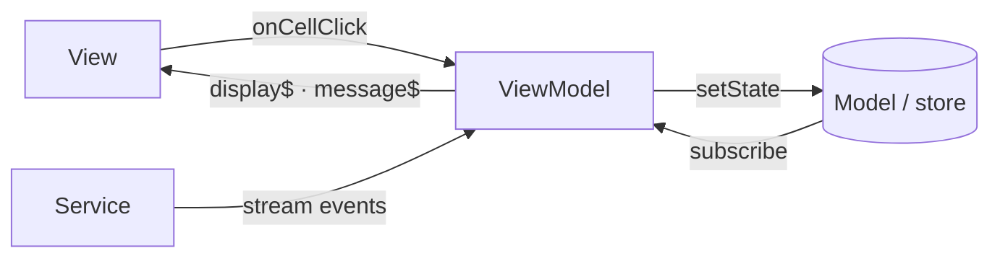

# MVVM (Model–View–ViewModel)

## Summary

MVVM splits an application into three roles: **Model** (truth), **View** (display + input surface), and **ViewModel** (presentation state + commands for the View). The View **binds** to the ViewModel—typically by subscribing to display-oriented streams or properties—and the ViewModel **maps** Model changes into what the screen needs.

The main difference from [MVC](./mvc.md): the View does **not** subscribe to the Model directly. It binds to the **ViewModel**.

The main difference from [MVP](./mvp.md): the View **does** react to state changes (reactive binding), but the state it reads is **ViewModel display state**, not raw `GameState`. Mapping logic lives **per ViewModel** (e.g. `BoardViewModel`, `MessageViewModel`), not in one central `updateViews` that knows every component.

**One-sentence summary (MVVM shape for this app):** The Memory Game in MVVM is **Model (store + domain) for truth, ViewModels that expose display streams and commands per component, and Views that bind to their ViewModel and forward input back to it**—reactive UI without Views reading domain state directly.

This document describes the **same game** with **MVVM role assignment**—use it to compare who holds display state and who the View listens to.

For the step-by-step build order, see [MVVM development flow](#mvvm-development-flow-roadmap). Compare with [MVC development flow](./mvc.md#mvc-development-flow-roadmap) and [MVP development flow](./mvp.md#mvp-development-flow-roadmap).

---

## MVVM vs MVC vs MVP (Memory Game)

Keep the domain fixed; change **what the View listens to** and **where display mapping lives**.

| Question | MVC | MVP | MVVM (this doc) |
|----------|-----|-----|-----------------|
| Who holds truth? | Model (store + domain) | Model — **same** | Model — **same** |
| Who applies rules? | domain, invoked by Controller | domain, invoked by Presenter | domain, invoked by **ViewModel** — **same logic, different caller** |
| Who handles cell click? | Controller | Presenter | **ViewModel** (`onCellClick` command) |
| Who updates the screen? | **View** subscribes to **store** | **Presenter** pushes to passive View | **View** subscribes to **ViewModel** display streams |
| Does View know `GameState`? | Yes (reads store) | No (passive API only) | **No** — View knows **ViewModel** bindings only |
| Where does “phase → highlight cell” live? | In View subscriber | In Presenter `updateViews` | In **BoardViewModel** mapper |
| Scales to many components? | Mapping scattered in Views | **Presenter grows** | **One ViewModel per component** |

```text
MVC:   User → View → Controller → domain → store ──subscribe──→ View (reads GameState)

MVP:   User → View → Presenter → domain → store → Presenter ──push──→ View

MVVM:  User → View → ViewModel → domain → store ──subscribe──→ ViewModel ──bind──→ View
```

**Why MVVM after MVP:** If ten components each need display rules, MVP centralizes ten mappings in the Presenter. MVVM **distributes** mapping into ten ViewModels while keeping Views free of domain types and business rules.

---

## The three roles

### Model

- Holds **application state** and **business rules** (same as MVC and MVP).
- Does **not** render the UI and does **not** know ViewModel or View display fields.
- Notifies subscribers when truth changes (e.g. `BehaviorSubject` in the store).

**In the Memory Game example (MVVM mapping)**

Reuse the same Model split as MVC and MVP:

| Piece | Location (shared concept) | Job in MVVM |
|-------|---------------------------|-------------|
| **State store** | `state/game-state-store.ts` | Holds `GameState`; `getState`, `setState`, `subscribe`, `destroy` |
| **Domain rules** | `domain/rules.ts`, `domain/pattern.ts` | Pure transitions and validation |

Nothing in the Model changes between styles—the difference is **ViewModels consume** the store; **Views consume** ViewModels.

#### Boundary note: Model — state store (`state/`)

| | |
|---|---|
| **Must have** | Single source of truth; read/write/notify API; merge-only `setState`. |
| **Must not have** | Business rules; DOM; ViewModel display fields (`highlightedCell`, formatted labels for UI-only concerns); View imports. |
| **Common confusions** | ❌ Adding `highlightedCellIndex` to `GameState` because the board needs it → derive in **BoardViewModel** from `pattern` + `gamePhase`. ❌ View subscribing to store “it's reactive anyway” → **ViewModel** is the binding source. ✅ Same store as MVC/MVP docs. |

#### Boundary note: Model — domain (`domain/`)

| | |
|---|---|
| **Must have** | Pure functions: `initialGameState`, `applyUserCellClick`, `getNextGameState`, etc. |
| **Must not have** | DOM; RxJS; ViewModel or View imports. |
| **Common confusions** | ❌ ViewModel inlining “wrong cell → game over” → **domain**. ❌ View formatting message text from raw phase enums → **MessageViewModel** or **View** display layer. ✅ Identical to [MVC domain boundary](./mvc.md#boundary-note-model--domain-domain). |

### View

- **Renders** what the **ViewModel** exposes (binds to streams / display properties).
- **Forwards user input** to ViewModel **commands** (e.g. `viewModel.onCellClick(index)`).
- Does **not** subscribe to the Model store, **does not** apply business rules, **does not** import domain.
- Owns **presentation mechanics** only: DOM, templates, CSS classes, flicker timing inside bind handlers—driven by **ViewModel display values**, not by reading `GameState`.

**In the Memory Game example (MVVM target shape)**

| Component | View responsibility |
|-----------|---------------------|
| **BoardView** | Subscribe to `boardViewModel.highlightedCell$`, `isInteractive$`, `levelTransition$`; update DOM; forward clicks to `boardViewModel.onCellClick` |
| **MessageView** | Subscribe to `messageViewModel.message$`; write text to DOM |
| **Templates** (`*.hbs`) | Static layout only; no store or ViewModel import |

Contrast with **MVP repo**: Presenter calls `boardView.highlightCell(...)` after every `setState`. In MVVM, **BoardViewModel** derives highlight from store changes; **BoardView** reacts to its ViewModel automatically.

Contrast with **MVC repo**: Board subscribes to `gameStateStore` and reads `gamePhase` + `pattern`. In MVVM, that mapping moves to **BoardViewModel**; the View only sees `highlightedCell$` and `isInteractive$`.

#### Boundary note: View (`components/`, `*.hbs`)

| | |
|---|---|
| **Must have** | DOM/templates; **bind** to ViewModel streams or properties; forward input to ViewModel commands; presentation-only mechanics (CSS, animation delays) using ViewModel **display** values. |
| **Must not have** | `gameStateStore.subscribe`; `setState`; domain imports; `if (wrong cell) game over`; mapping `GameState` → highlight rules. |
| **Common confusions** | ❌ `if (gamePhase === 'USER_TURN')` in View → **ViewModel** exposes `isInteractive$`. ❌ View calls domain on click → **ViewModel** command. ✅ `highlightedCell$.subscribe(cell => ...)` → correct binding. ✅ Flicker delay in View when ViewModel emits `flicker: true` → presentation in View, **decision** in ViewModel. |

### ViewModel

- **Presentation layer** between Model and View: exposes **display-oriented state** and **commands** the View can bind to and invoke.
- **Subscribes** to the Model (store) and **maps** `GameState` → UI-facing values (per component or per screen).
- **Handles user intents**: on command → call **domain** → **`setState`** → (store notifies ViewModel → View updates via binding).
- **Orchestrates side flows** when needed (pattern sequence via service)—same technical role as Controller/Presenter for timers/streams.
- Does **not** own long-term domain truth—that stays in the store. ViewModel state is **derived** or **command-driven**, not a second copy of `GameState` unless you explicitly snapshot for display (avoid drift).

**In the Memory Game example (MVVM target shape)**

| Concern | ViewModel (conceptual) |
|---------|------------------------|
| Bootstrap | Create store, ViewModels, Views; wire bindings; `startGame` / `destroy` |
| Board display | `BoardViewModel`: `highlightedCell$`, `isInteractive$`, `levelTransition$` from store |
| Message display | `MessageViewModel`: `message$` from store (phases that show text) |
| Cell click | `onCellClick` → `applyUserCellClick` → `setState` (no View involved in rules) |
| Pattern sequence | `MemoryGameViewModel` (or coordinator) subscribes to `getPatternSequence` → domain → `setState` |

**Scaling pattern:** one ViewModel per component (or per screen), not one mega-mapper for the whole app.

#### Boundary note: ViewModel

| | |
|---|---|
| **Must have** | Display mappers (store → streams/DTOs); commands for user actions; domain calls + `setState`; service subscription ownership for pattern flow; `destroy()` to unsubscribe store/service. |
| **Must not have** | DOM (`document`, `innerHTML`, `classList`); HTML/templates; duplicating domain rules inline; exposing raw `GameState` to View as the primary binding (defeats the layer). |
| **Common confusions** | ❌ ViewModel sets CSS classes → **View** binds and paints. ❌ ViewModel skips domain and mutates store fields with validation logic → **domain**. ❌ Ten components, one 800-line ViewModel → split into **BoardViewModel**, **MessageViewModel**, etc. ✅ `message$ = store.pipe(map(state => ...))` → correct. ✅ `onCellClick` calls `applyUserCellClick` → correct command. |

---

## Supporting layers

Same as MVC and MVP: **not** a fourth MVVM role. **Services** and **types** support Model and ViewModel.

### Services (`services/`)

Identical role to [MVC services](./mvc.md#services-services): timing/streams (e.g. `getPatternSequence`). **ViewModel** (coordinator) subscribes—not View, not service writing to store.

| | |
|---|---|
| **Must have** | Technical plumbing; typed inputs/outputs; delegate pattern generation to **domain**. |
| **Must not have** | `setState`; DOM; calling View methods. |
| **MVVM note** | On each emission → ViewModel updates Model via domain → store notifies ViewModels → Views bind and update. |

### Types (`types/`)

Shared contracts: `GameState`, `GamePhase`, `GameStateStore`, plus **ViewModel-facing types**:

```ts
// conceptual — types/view-model-contracts.ts
type BoardDisplayState = {
  highlightedCell: CellIndex | null;
  isInteractive: boolean;
  flicker: boolean;
  levelTransition: boolean;
};

type BoardViewModel = {
  readonly display$: Observable<BoardDisplayState>;
  readonly onCellClick: (index: CellIndex) => void;
  readonly destroy: () => void;
};
```

View depends on **ViewModel interface**; ViewModel depends on **store + domain**—not the other way around.

---

## Typical sequence

### User clicks a cell (user turn) — MVVM

1. User clicks a cell on **BoardView** (View).
2. View calls **`boardViewModel.onCellClick(cellIndex)`** (command).
3. **ViewModel** calls **domain** (`applyUserCellClick`), then **`setState`** on store.
4. Store notifies **ViewModel** subscribers.
5. **BoardViewModel** / **MessageViewModel** recompute display values.
6. **Views** bound to ViewModel streams update the DOM.

```text
User click  →  View  →  ViewModel (command)  →  domain  →  store  →  ViewModel (map)  →  View (bind)
```

### Pattern sequence (computer turn) — MVVM

1. **MemoryGameViewModel** starts `getPatternSequence(gameState)`.
2. On each emission → domain → `setState`.
3. Store notifies ViewModels; **BoardViewModel** derives `highlightedCell$`; **MessageViewModel** derives `message$`.
4. Views update via existing bindings—no manual push per component.

### Side-by-side with MVC and MVP

| Step | MVC | MVP | MVVM |
|------|-----|-----|------|
| Model updated | `setState` | `setState` | `setState` |
| Screen updates | View reads **store** | Presenter **pushes** View | View reads **ViewModel** |
| Click wiring | View → Controller | View → Presenter | View → ViewModel command |
| Display mapping | Often in View | In Presenter `updateViews` | In **each ViewModel** |

---

## User interaction and event handlers

| Concern | Owner (MVVM) | Memory Game |
|---------|--------------|-------------|
| What user sees/clicks | View | Board + message templates |
| Raw click detection | View → ViewModel command | `fromEvent` → `boardViewModel.onCellClick` |
| Meaning of click | ViewModel + domain | `applyUserCellClick` |
| Highlight / interactivity | ViewModel display + View bind | `BoardViewModel.display$` → BoardView |
| Starting pattern flow | ViewModel (coordinator) | `getPatternSequence` subscribe in ViewModel |

### Rules of thumb

- **View binds, ViewModel decides display meaning** — View never imports `GameState`.
- **View forwards, ViewModel executes** — commands call domain, not the View.
- **One ViewModel per component** when the UI grows—avoid a single god ViewModel.
- **Domain stays pure** — ViewModel never grows validation; it delegates to domain.

### Memory Game: who does what on a cell click (MVVM)

| Step | Role | What happens |
|------|------|----------------|
| 1 | View | User clicks cell; calls `boardViewModel.onCellClick(i)` |
| 2 | ViewModel | `applyUserCellClick` → `setState` |
| 3 | Model | Store holds new `GameState` |
| 4 | ViewModel | Mappers derive new display state |
| 5 | View | Bindings update message text, highlights, interactivity |

---

## Shared example walkthrough (Memory Game)

### Target layout → MVVM roles

```text
observable-memory-game-mvvm/src/app/   (target — implement after reading this doc)
├── memory-game-view-model.ts     → Coordinator: bootstrap, pattern service, lifecycle
├── memory-game.hbs               → View (layout)
├── state/                        → Model (store) — unchanged
├── domain/                       → Model (rules) — unchanged
├── view-models/
│   ├── board-view-model.ts       → Board display$ + onCellClick
│   └── message-view-model.ts     → message$
├── components/
│   ├── board/board-view.ts       → Binds to BoardViewModel; no store
│   └── message/message-view.ts   → Binds to MessageViewModel; no store
├── services/                     → Infrastructure — unchanged
└── types/
    ├── types.ts                  → GameState, etc.
    └── view-model-contracts.ts   → ViewModel interfaces (optional)
```

### ViewModel: mapping store → display (core MVVM skill)

```ts
// conceptual — BoardViewModel
function mapBoardDisplay(state: GameState): BoardDisplayState {
  const isUserTurn = state.gamePhase === 'USER_TURN';
  const current = state.pattern[state.pattern.length - 1];
  const prev = state.pattern[state.pattern.length - 2];

  return {
    highlightedCell:
      state.gamePhase === 'SHOW_SEQUENCE' || state.gamePhase === 'USER_TURN'
        ? (current ?? null)
        : null,
    isInteractive: isUserTurn,
    flicker: current === prev,
    levelTransition: state.gamePhase === 'NEXT_LEVEL',
  };
}

function createBoardViewModel(store: GameStateStore): BoardViewModel {
  // display$ emits whenever the store notifies (map GameState → BoardDisplayState)
  const display$ = /* derived from store.subscribe / shared store observable */;

  return {
    display$,
    onCellClick(cellIndex) {
      store.setState(applyUserCellClick(store.getState(), cellIndex));
      // NEXT_LEVEL / pattern restart — coordinator or this ViewModel
    },
    destroy() { /* unsubscribe from store */ },
  };
}
```

Mapping lives in **ViewModel**—not in View (MVC), not in one Presenter `updateViews` (MVP).

### Comparison hook (use across all wiki styles)

| Style | Who updates the screen? |
|-------|-------------------------|
| [MVC](./mvc.md) | View (subscribe to **store**) |
| [MVP](./mvp.md) | Presenter → View methods |
| **MVVM** | View (subscribe to **ViewModel** display state) |

Same reactivity as MVC; **indirection** through ViewModel is what changes.

---

## Reactive binding (why RxJS here)

This project already uses RxJS for the store and services. MVVM maps naturally to **observable ViewModels**:

- Store emits `GameState` → ViewModel **maps** to display streams.
- View **subscribes once** at mount to `display$` / `message$` and updates DOM.
- Commands are methods on ViewModel; no central push after every `setState`.

That is still MVVM:

- **Model** owns truth (store + domain).
- **ViewModel** owns presentation state and commands.
- **View** owns rendering and input wiring.

Frameworks (Vue, Angular, Knockout) automate binding; in vanilla TypeScript, **`subscribe` + update DOM** is the manual equivalent of `{{ message }}` or `[message]="vm.message$"`.

Compare [Reactive MVC](./mvc.md#reactive-mvc-why-rxjs-here): MVC View subscribes to **Model**; MVVM View subscribes to **ViewModel**.

---

## MVVM development flow (roadmap)

Same domain and store as MVC/MVP; **Phase 5 is ViewModels**, **Phase 6 Views bind to ViewModels** (not store).

| Phase | MVVM focus |
|-------|------------|
| 1 · types | `GameState` + ViewModel display types / contracts |
| 2 · domain | Unchanged from MVC |
| 3 · store | Unchanged; **ViewModels** subscribe, not Views |
| 4 · services | ViewModel coordinator subscribes |
| 5 · **ViewModels** | Per-component mappers + commands; pattern orchestration |
| 6 · **Views** | Bind to ViewModel streams; forward clicks to commands; **no store** |
| 7 · Integrate | Coordinator `startGame` / `destroy`; wire page lifecycle |
| 8 · Harden | Grep `gameStateStore.subscribe` under `components/` — should be **zero** |



Compare with [MVP development flow](./mvp.md#mvp-development-flow-roadmap): MVP Presenter **pushes**; MVVM ViewModel **exposes** and View **pulls via binding**.

---

## Error handling

Same **by-layer ideas** as [MVC error handling](./mvc.md#error-handling); replace Controller/Presenter → **ViewModel**.

| Layer | MVVM note |
|-------|-----------|
| **domain** | Expected failures as state (`GAME_OVER`) — unchanged |
| **ViewModel** | Catch exceptional errors; map to `setState`; display mappers surface safe message in `message$` |
| **View** | Shows bound error/terminal display state only |
| **services** | Stream errors to **ViewModel** coordinator, not View |

**MVVM-specific rule:** After mapping an error to store state, **ViewModels** derive user-visible text into display streams—Views already bound will update automatically.

---

## Lifecycle (subscribe & unsubscribe)

| Who subscribes (MVVM) | Tear down |
|-----------------------|-----------|
| **ViewModel** → store | ViewModel `destroy()` |
| **ViewModel** → service (pattern) | Coordinator `destroy()`; unsubscribe before new level |
| **View** → ViewModel streams | View `destroy()` — **not** store |
| **View** → store | ❌ **Avoid** |
| Page navigation / reload | App entry calls coordinator `destroy()` |

Each ViewModel and View returns `destroy()`; coordinator tears down pattern subscription and child ViewModels.

**Async bind caution:** if View uses `async` inside a ViewModel subscription (flicker delay), cancel stale work on destroy or generation counter—same as [MVC lifecycle note](./mvc.md#async-subscriber-caution-board).

---

## Accessibility

Primary owner remains **View** (semantics, keyboard, `aria-live`). **ViewModel** exposes meaningful display strings and `isInteractive` (or equivalent) for the View to map to ARIA/`tabindex`.

| Layer | MVVM note |
|-------|-----------|
| **Model** | Human-readable `gameMessage` — unchanged |
| **ViewModel** | `message$` carries text View should show/announce; `isInteractive$` drives keyboard/mouse parity |
| **View** | `<button>` cells, `aria-live` on message — bind from ViewModel |

Do not set ARIA from ViewModel code that touches DOM—View binds ViewModel values to markup.

See [MVC accessibility](./mvc.md#accessibility) for detailed View checklist.

---

## Testing

MVVM boundaries support **ViewModel unit tests** without DOM and **View tests** with mock ViewModels.

| Layer | What to test |
|-------|----------------|
| **domain** | Same unit tests as MVC |
| **ViewModel** | Given store state or command → domain/`setState` called → **display$ emits expected** display DTO |
| **View** | Mock ViewModel streams; assert DOM updates; forward click invokes command |
| **services** | Same as MVC |

**High-value MVVM test:** push `GameState` into test store; assert `boardViewModel.display$` emits `{ isInteractive: true, ... }` without DOM.

---

## Pros

- **Scales to many components** — each ViewModel owns its mapping; no central `updateViews` god function.
- **Reactive UI** — Views update when ViewModel streams emit; no manual push after every `setState`.
- **View stays dumb about domain** — unlike MVC, View never reads `GameState` or imports domain.
- **Testable presentation layer** — assert display streams and commands without DOM.
- **Model/domain reuse** — same `rules.ts`, same store as MVC and MVP.

## Cons

- **More layers than MVC** — store → ViewModel → View; more files and indirection.
- **ViewModel discipline** — easy to turn ViewModel into a “mini Presenter” with domain rules if boundaries slip.
- **Manual binding in vanilla TS** — no framework templating; you write `subscribe` and DOM updates yourself.
- **Duplicate subscription paths** — several ViewModels may subscribe to the same store (acceptable with clear ownership and teardown).
- **Display state drift** — if ViewModel caches domain state instead of deriving, it can desync from store.

---

## Quick check

1. **Truth or rules?** → Model (`state/`, `domain/`)
2. **Showing truth on screen?** → View — **bound to ViewModel**
3. **Mapping Model → display + handling commands?** → **ViewModel**
4. **Streams / timing?** → services (ViewModel coordinator subscribes)
5. **Shapes / ViewModel contracts?** → types

### MVVM smell test

| Smell | Problem |
|-------|---------|
| `gameStateStore.subscribe` inside a component View | MVC-style; bind to **ViewModel** instead |
| View imports `applyUserCellClick` | View too smart; use ViewModel command |
| ViewModel sets `classList` directly | Bypass View; emit display state, View binds |
| One ViewModel maps all ten screens | Split per component/screen |
| ViewModel duplicates domain validation | Call **domain**, don't reimplement rules |

### Where does this code go? (cheat sheet)

| You are writing… | Layer |
|------------------|--------|
| Wrong cell → game over | domain |
| `onCellClick` → domain → `setState` | ViewModel (command) |
| `gamePhase === 'USER_TURN'` → `isInteractive` | ViewModel (mapper) |
| `highlightedCell$.subscribe` → CSS highlight | View (bind) |
| Flicker delay after ViewModel emits `flicker: true` | View (presentation) |
| `getPatternSequence` subscribe | ViewModel (coordinator) |
| `BoardViewModel` interface | types |
| `GameState` shape | types (Model) |

---

